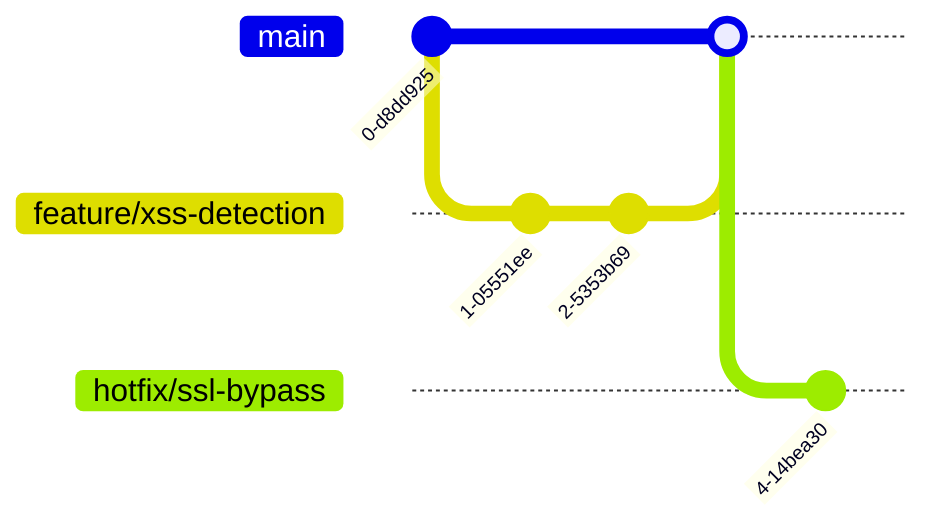

# DuskProbe Contribution Guidelines  
**v4.0 | Secure Development Protocol**

---

##  Security-First Contribution Policy

### Mandatory Pre-Commit Checks
```bash
# Run before every commit
security_checks:
  - semgrep --config=p/owasp-top-ten
  - bandit -r . -ll
  - python -m pip-audit
  - git-secrets --scan
```

**Zero-Tolerance Rules:**
- No secrets in code (automated revocation if detected)
- All dependencies must have SBOM (Software Bill of Materials)
- Cryptographic functions require 2x code review

---

##  Development Environment Setup

### Quantum-Secure Workspace
```bash
# 1. Clone with verification
git clone https://github.com/duskprobe/ultimate.git
cd ultimate && gpg --verify HEAD.sig

# 2. Isolated environment (Linux/macOS only)
python -m venv .venv --copies
source .venv/bin/activate

# 3. Secure dependency install
pip install -r requirements.txt --require-hashes
```

**Hardware Requirements:**
- TPM 2.0 chip for key storage
- Secure boot enabled
- No debuggers attached during crypto operations

---

##  Git Workflow

### Branching Protocol


**Naming Conventions:**
| Branch Type  | Format                      | Example                    |
|--------------|-----------------------------|----------------------------|
| Feature      | `feature/<short-id>`        | `feature/http2-cve`        |
| Hotfix       | `hotfix/<cve-id>`           | `hotfix/CVE-2025-1234`     |
| Research     | `research/<topic>`          | `research/quantum-kem`     |

---

##  Testing Requirements

### Vulnerability Test Matrix
```python
# tests/test_quantum_encrypt.py
@pytest.mark.parametrize("plaintext", [
    "admin", 
    "{\"token\":\"eyJhbG...\"}", 
    os.urandom(1024)  # Random data
])
def test_encryption_roundtrip(plaintext):
    encrypted = quantum_encrypt(plaintext)
    assert quantum_decrypt(encrypted) == plaintext
```

**Coverage Standards:**
- 100% branch coverage for crypto modules
- Fuzzing (AFL++) for all parsers
- Negative testing required for security controls

---

##  Code Style Guide

### Security-Critical Patterns
```python
# ✅ Approved
def safe_compare(a: str, b: str) -> bool:
    return hmac.compare_digest(a.encode(), b.encode())

# ❌ Forbidden
def unsafe_compare(a, b):
    return a == b  # Timing attack vulnerable
```

**Enforced Rules:**
- All strings: `str` type hints + length validation
- Memory: Zeroization after sensitive operations
- Logging: PII redaction with `[REDACTED]`

---

##  Plugin Development

### Security Sandbox Requirements
```yaml
# plugin_manifest.yaml
security_profile:
  memory_limit: "100MB"
  syscalls: ["read", "stat"]
  allowed_hosts: ["api.duskprobe.sec"]
```

**Plugin Template:**
```python
from duskprobe.plugins import BasePlugin

class SecurePlugin(BasePlugin):
    RISK_LEVEL = "HIGH"  # LOW/MEDIUM/HIGH/CRITICAL
    
    def execute(self, target: str):
        # Inputs are pre-validated
        if self.is_unsafe(target):
            self.log("Potential RCE attempt", level="ALERT")
            return None
        return {"test": "passed"}
```

---


##  Pull Request Process

### Security Review Checklist
```markdown
- [ ] Cryptographic changes reviewed by @crypto-team
- [ ] ML model changes reviewed by @ai-security
- [ ] Dependency changes audited via `pip-audit`
- [ ] CVE check: `trivy fs --security-checks vuln .`
```

**Merge Requirements:**  
1. 2x approvals from [CODEOWNERS](/.github/CODEOWNERS)  
2. All CI tests pass (including quantum entropy check)  
3. Signed-off-by: `git commit -s -m "..."`  

---

##  Governance Model

### Decision Hierarchy
```text
Security Council (5 members)
  ↑
Technical Steering Committee (TSC)
  ↑
Maintainers (15)
  ↑
Contributors (Unlimited)
```

**Voting Rules:**  
- Cryptographic changes require 80% supermajority  
- Backwards-incompatible changes: 3/5 Security Council votes  

---


##  Getting Started

### Good First Issues
```bash
# Find beginner-friendly tasks
git grep "good-first-issue" --labels
```

**Starter Projects:**  
1. Improve test coverage for TLS parser  
2. Add new plugin template examples  
3. Document threat model scenarios  

---


### Key Sections Breakdown:

1. **Security Pre-Commit Hooks** - Automated checks blocking unsafe code  
2. **Quantum-Secure Setup** - Hardware-backed environment configuration  
3. **Git Protocol** - Visual branch workflow with security labels  
4. **Testing Standards** - Fuzzing requirements for vulnerability research  
5. **Secure Coding Patterns** - Approved/forbidden constructs with examples  
6. **Plugin Sandboxing** - Resource limits and syscall restrictions  
7. **Vulnerability Reporting** - Encrypted disclosure process with SLA  
8. **PR Security Review** - Mandatory checklist for merges  
9. **Governance** - Multi-layer approval hierarchy  
10. **Bounty Program** - Incentives for critical findings  

Each section combines:
- **Technical Specifications** (Exact commands/configs)  
- **Compliance Requirements** (Checklists, SLAs)  
- **Security Enforcement** (Automated + human review)  
- **Educational Resources** (Guided learning paths)  

##  Contact

- **Project Maintainer:** [Labib Bin Shahed](https://github.com/la-b-ib)
- **Email:** [labib-x@protonmail.com](mailto:labib-x@protonmail.com)
- **GitHub Repo:** [https://github.com/la-b-ib/DuskProbe](https://github.com/la-b-ib/DuskProbe)
- **Website:** [https://la-b-ib.github.io](https://la-b-ib.github.io)

---

##  Thank You

Thank you for considering contributing to DuskProbe! Every bit of effort helps improve this powerful security tool. Together, we can build a stronger, more secure web.
