# DuskProbe Documentation

**Version**: 4.2  
**Description**: DuskProbe is a professional web vulnerability scanner designed for detecting common and advanced web vulnerabilities, including XSS, SQLi, LFI, Web3 contract issues, cryptocurrency miners, and network anomalies. It supports asynchronous scanning, Tor integration, ML-based anomaly detection, and secure plugin loading.

## Features

### Core Scanning Capabilities
- **Vulnerability Scanning**:
  - Cross-Site Scripting (XSS): Tests for reflected XSS using payloads from `payloads.json`.
  - SQL Injection (SQLi): Detects SQL errors with payloads like `' OR 1=1 --`.
  - Local File Inclusion (LFI): Checks for file access with payloads like `../../etc/passwd`.
- **Web Crawling**:
  - Asynchronous crawling with `aiohttp`, respecting `robots.txt`.
  - Canonical URL deduplication to avoid redundant scans.
  - Bloom filter for efficient URL tracking (default capacity: 100,000).
- **Security Header Checks**:
  - Validates presence of `Content-Security-Policy`, `X-Frame-Options`, `X-Content-Type-Options`, and `Strict-Transport-Security`.

### Advanced Scanning
- **Web3 Auditing**:
  - Scans for Ethereum contract addresses and ABIs in web content.
  - Detects vulnerabilities like `DELEGATECALL` and `SELFDESTRUCT` in contract bytecode.
- **GraphQL Introspection**:
  - Checks for enabled GraphQL introspection queries, indicating potential data exposure.
- **HTTP/2 Vulnerabilities**:
  - Tests for CVE-2023-43622 (Rapid Reset) and HPACK bomb vulnerabilities.
- **Dependency Confusion**:
  - Scans `package.json` and `requirements.txt` for internal packages published in public registries (NPM, PyPI).
- **Cryptocurrency Miner Detection**:
  - Identifies miner scripts using regex patterns (e.g., `coin-hive`, `xmrig`).
- **SSL/TLS Validation**:
  - Checks for expired certificates, deprecated protocols (SSLv3, TLSv1.0/1.1), and weak ciphers (RC4, MD5).
- **ML-Based Anomaly Detection**:
  - Uses Isolation Forest to detect anomalies in TCP packet features (length, ports, payload size) from PCAP files.

### Security Features
- **Encryption**:
  - Fernet-based encryption for reports and configurations using SHA3-256 derived keys.
  - Key hint storage for encrypted reports.
- **Plugin Security**:
  - HMAC-based signature verification for plugins using SHA256.
  - Regex-based checks for dangerous code patterns (e.g., `os.system`, `exec`).
- **File Permissions**:
  - Configurations, reports, and ML models: 0o600.
  - Directories (`plugins`, `reports`, `config`): 0o700.
- **Input Validation**:
  - Strict validation of URLs, file paths, and JSON configs to prevent injection.

### Performance Optimizations
- **Connection Pooling**:
  - `aiohttp` TCP connector with a limit of 50 concurrent connections.
- **Asynchronous I/O**:
  - All HTTP requests, Web3 audits, and miner detection use `aiohttp`.
- **Concurrency**:
  - `ThreadPoolExecutor` for CPU-bound tasks (max 50 threads).
  - `asyncio.gather` for I/O-bound tasks.
- **Rate Limiting**:
  - Handles HTTP 429 responses with `Retry-After` header support (max delay: 10s).

### Usability
- **CLI Interface**:
  - Supports single URL or file-based URL lists.
  - Configurable via JSON files and command-line arguments.
- **Reporting**:
  - Formats: HTML, JSON, Markdown.
  - Includes severity-sorted findings and summary statistics.
  - Optional encryption with key hints.
- **Logging**:
  - Rotated logs (`duskprobe.log`, 10MB, 5 backups).
  - Levels: DEBUG, INFO, WARNING, ERROR.

### Integration
- **Tor Network**:
  - Optional Tor integration with periodic circuit renewal (every 5 minutes).
  - Uses ports 9050 or 9150.
- **Authentication**:
  - Supports Basic and Form-based authentication via JSON config.
- **Plugins**:
  - Extensible via Python modules in `plugins/` directory.
  - Requires a `Plugin` class with a `run` method.

## Installation

### Prerequisites
- **Python**: 3.8+
- **Operating System**: Linux (recommended), macOS, or Windows (with WSL for Tor).
- **Tor**: Required for Tor integration.

### Install Dependencies
```bash
pip install aiohttp requests stem web3 scikit-learn scapy pybloom-live cryptography colorama fake-useragent beautifulsoup4
sudo apt install tor
```

### Set Environment Variables (Optional)
```bash
export DUSKPROBE_ENCRYPTION_KEY="your_secure_key_here"
```

### Directory Setup
```bash
mkdir -p plugins reports config
chmod 700 plugins reports config
```

## Usage

### Command-Line Interface
```bash
python DuskProbe.py [options]
```

#### Options
| Option | Description | Default |
|--------|-------------|---------|
| `-u, --url` | Single URL to scan (e.g., `https://example.com`) | None |
| `-f, --file` | File with URLs (one per line) | None |
| `-t, --threads` | Number of threads (1-50) | 50 |
| `-a, --auth` | Path to authentication JSON config | None |
| `-p, --proxy` | Proxy server (e.g., `http://127.0.0.1:8080`) | None |
| `--crawl-depth` | Maximum crawl depth (1-10) | 5 |
| `--enable-tor` | Use Tor network | False |
| `--enable-web3` | Enable Web3 scanning | False |
| `--enable-ml` | Enable ML analysis | False |
| `--pcap` | Path to PCAP file for ML analysis | None |
| `--encrypt-report` | Encrypt the final report | False |
| `-o, --output` | Output format (`html`, `json`, `markdown`) | `html` |

#### Example Commands
```bash
# Scan a single URL with HTML report
python DuskProbe.py -u https://example.com --output html

# Scan multiple URLs with Tor and encrypted report
python DuskProbe.py -f urls.txt --enable-tor --encrypt-report

# Enable ML analysis with PCAP file
python DuskProbe.py -u https://example.com --enable-ml --pcap network.pcap
```

### Authentication Config (`auth.json`)
```json
{
  "type": "FORM",
  "url": "https://example.com/login",
  "username": "user",
  "password": "pass",
  "username_field": "username",
  "password_field": "password",
  "success_indicator": "dashboard"
}
```

### Plugin Development
- **Location**: `plugins/` directory.
- **Naming**: Files must start with `plugin_` and end with `.py` (e.g., `plugin_example.py`).
- **Structure**:
  ```python
  class Plugin:
      def run(self, url: str) -> Dict:
          return {
              "type": "EXAMPLE",
              "severity": "INFO",
              "details": f"Scanned {url}"
          }
  ```
- **Signature Verification**:
  - Add HMAC-SHA256 signature to `config/encryption.json`:
    ```json
    {
      "plugin_signatures": {
        "plugin_example.py": "hmac_sha256_of_file_hash"
      },
      "hmac_key": "your_hmac_key"
    }
    ```
  - Generate HMAC:
    ```python
    import hmac, hashlib
    file_hash = "your_file_sha256_hash"
    hmac_key = "your_hmac_key"
    print(hmac.new(hmac_key.encode(), file_hash.encode(), hashlib.sha256).hexdigest())
    ```

## Technical Details

### Architecture
DuskProbe is structured as a modular, object-oriented system with distinct components for scanning, configuration, and reporting.

#### Mermaid Graph

```mermaid
classDiagram
    class DuskProbe {
        -session_manager: SessionManager
        -adv_scanner: AdvancedScanner
        -vuln_scanner: VulnerabilityScanner
        -results: Dict
        +scan_url(url: str)
        +scan_urls(urls: List[str])
        +generate_advanced_report(format: str, encrypt: bool) str
    }
    class SessionManager {
        -session: requests.Session
        -auth: Dict
        -proxy: Dict
        +request(method: str, url: str) Response
        +handle_auth()
    }
    class AdvancedScanner {
        -session: SessionManager
        -config: Config
        -bloom_filter: BloomFilter
        -graphql_scanner: GraphQLScanner
        -policy_checker: SecurityPolicyChecker
        -http2_scanner: HTTP2Scanner
        -dependency_scanner: DependencyScanner
        -web3_auditor: Web3Auditor
        -miner_detector: CryptoMinerDetector
        -ml_analyzer: QuantumMLAnalyzer
        -ssl_checker: SSLChecker
        -tor_manager: TorNetworkManager
        -encryptor: QuantumEncryptor
        +advanced_vulnerability_scan(url: str) List[Dict]
        +crawl_website(url: str, max_depth: int) Generator
        +check_ssl(url: str) Dict
        +cleanup()
    }
    class VulnerabilityScanner {
        -session: SessionManager
        -config: Config
        -payloads: Dict
        +run_all_tests(url: str) List[Dict]
        +test_xss(url: str) List[Dict]
        +test_sqli(url: str) List[Dict]
        +test_lfi(url: str) List[Dict]
    }
    class Config {
        -config_path: str
        -payloads: Dict
        -wordlists: Dict
        -report_config: Dict
        -advanced_settings: Dict
        -encryption_config: Dict
        -plugins: List
        +_load_config(filename: str, default: Dict) Dict
        +_load_plugins() List
    }
    class QuantumEncryptor {
        -key: bytes
        -cipher: Fernet
        +encrypt(data: str) str
        +decrypt(encrypted_data: str) str
    }
    class TorNetworkManager {
        -controller: Controller
        -tor_process: Process
        -tor_port: int
        +start_tor_service() bool
        +renew_circuit()
        +stop()
    }
    class AdvancedSession {
        -session: aiohttp.ClientSession
        -use_tor: bool
        -user_agent: str
        -cookie_jar: aiohttp.CookieJar
        -connector: aiohttp.TCPConnector
        +fetch(url: str, method: str) str
    }
    class Web3Auditor {
        -w3: Web3
        -contract_pattern: Pattern
        -abi_pattern: Pattern
        +audit_contract(url: str) List[Dict]
    }
    class QuantumMLAnalyzer {
        -model: IsolationForest
        -scaler: StandardScaler
        -anomalies: List
        +analyze(pcap_path: str) List[Dict]
    }
    class SSLChecker {
        +run(hostname: str) Dict
    }
    class GraphQLScanner {
        -session: SessionManager
        +check_introspection(url: str) Dict
    }
    class HTTP2Scanner {
        +check_http2_vulnerabilities(host: str, port: int) List[Dict]
    }
    class DependencyScanner {
        -session: SessionManager
        +check_dependency_confusion(urls: List[str]) List[Dict]
    }
    class CryptoMinerDetector {
        -patterns: List[Pattern]
        +detect(url: str) List[Dict]
    }
    class SecurityPolicyChecker {
        -session: SessionManager
        -required_headers: List[str]
        +check_headers(url: str) Dict
    }
    class ReportGenerator {
        -results: Dict
        -config: Dict
        -encryptor: QuantumEncryptor
        +generate(format: str, encrypt: bool) str
    }

    DuskProbe --> SessionManager
    DuskProbe --> AdvancedScanner
    DuskProbe --> VulnerabilityScanner
    AdvancedScanner --> SessionManager
    AdvancedScanner --> Config
    AdvancedScanner --> GraphQLScanner
    AdvancedScanner --> SecurityPolicyChecker
    AdvancedScanner --> HTTP2Scanner
    AdvancedScanner --> DependencyScanner
    AdvancedScanner --> Web3Auditor
    AdvancedScanner --> CryptoMinerDetector
    AdvancedScanner --> QuantumMLAnalyzer
    AdvancedScanner --> SSLChecker
    AdvancedScanner --> TorNetworkManager
    AdvancedScanner --> QuantumEncryptor
    VulnerabilityScanner --> SessionManager
    VulnerabilityScanner --> Config
    Config --> QuantumEncryptor
    ReportGenerator --> QuantumEncryptor
    GraphQLScanner --> SessionManager
    SecurityPolicyChecker --> SessionManager
    DependencyScanner --> SessionManager
```


### Dependencies
| Library | Version | Purpose |
|---------|---------|---------|
| aiohttp | Latest | Asynchronous HTTP requests |
| requests | Latest | Synchronous HTTP requests with retries |
| stem | Latest | Tor control and circuit management |
| web3 | Latest | Web3 contract auditing |
| scikit-learn | Latest | ML-based anomaly detection |
| scapy | Latest | PCAP packet analysis |
| pybloom-live | Latest | Bloom filter for URL tracking |
| cryptography | Latest | Fernet encryption |
| colorama | Latest | Colored console output |
| fake-useragent | Latest | Randomized User-Agent headers |
| beautifulsoup4 | Latest | HTML parsing for crawling |

### Configuration Files
- **Location**: `config/`
- **Files**:
  - `payloads.json`: XSS, SQLi, LFI payloads.
  - `wordlists.json`: Directory, file, subdomain wordlists.
  - `report_config.json`: Report template and severity colors.
  - `advanced_settings.json`: Scan settings (e.g., `max_depth`, `enable_tor`).
  - `encryption.json`: Encryption key, HMAC key, plugin signatures.
- **Permissions**: 0o600 (read/write for owner only).

### Performance Metrics
- **HTTP Requests**: Up to 50 concurrent requests via `aiohttp`.
- **Crawl Depth**: Configurable (default: 5).
- **Bloom Filter**: 100,000 capacity, 0.01 error rate, with capacity monitoring.
- **Thread Pool**: Up to 50 threads for CPU-bound tasks.
- **Rate Limiting**: Dynamic delays based on `Retry-After` (max 10s).

### Security Considerations
- **Encryption**: Uses Fernet with SHA3-256 keys for reports and configs.
- **Plugin Validation**: HMAC-SHA256 signatures and dangerous code checks.
- **Tor**: Periodic circuit renewal (every 5 minutes) for anonymity.
- **File Security**: Strict permissions to prevent unauthorized access.
- **Input Sanitization**: Prevents injection via URL and config validation.

## Testing

### Unit Tests
```python
import pytest
from DuskProbe import QuantumEncryptor, Config

def test_encryptor():
    enc = QuantumEncryptor("test_key")
    data = "test"
    encrypted = enc.encrypt(data)
    assert enc.decrypt(encrypted) == data

def test_config_load():
    config = Config()
    assert isinstance(config.payloads, dict)
    assert "xss" in config.payloads
```
Run: `pytest test_duskprobe.py`

### Integration Tests
1. Scan `http://testphp.vulnweb.com` with `--enable-tor` and `--enable-ml`.
2. Verify HTML, JSON, and Markdown report generation.
3. Test encrypted reports with `DUSKPROBE_ENCRYPTION_KEY`.

### Edge Cases
1. Invalid URLs (e.g., `ftp://example.com`).
2. Missing PCAP files for ML analysis.
3. Malformed `auth.json` or `config` files.
4. Malicious plugins with dangerous code (e.g., `os.system`).

### Performance Tests
1. Scan a large site with `--crawl-depth 5`.
2. Monitor memory usage and Bloom filter capacity.

### Security Tests
1. Attempt directory traversal in config paths.
2. Test with long URLs or payloads to ensure stability.
3. Verify plugin signature rejection for unsigned plugins.

## Limitations
- **Web3 Scanning**: Requires a valid provider (e.g., Infura).
- **ML Analysis**: Needs a pre-captured PCAP file.
- **Tor**: Requires installed Tor binary and available ports (9050/9150).
- **OAuth2**: Not supported (only Basic and Form authentication).
- **WebSocket**: Scanning excluded due to incomplete implementation.

## Troubleshooting
- **Tor Fails to Start**: Ensure `tor` is installed (`sudo apt install tor`) and ports 9050/9150 are free.
- **Web3 Not Connected**: Set `web3_provider` in `advanced_settings.json` or disable `--enable-web3`.
- **PCAP File Missing**: Provide a valid PCAP file via `--pcap` or disable `--enable-ml`.
- **Plugin Load Failure**: Verify HMAC signatures in `encryption.json` and ensure `Plugin` class exists.
- **Rate Limiting**: Increase delays or reduce threads (`--threads`) for HTTP 429 errors.


## Project Documentation

<div style="display: flex; gap: 10px; margin: 15px 0; align-items: center; flex-wrap: wrap;">

[](LICENSE)
[](SECURITY.md)
[](CONTRIBUTING.md)
[](CODE_OF_CONDUCT.md)

</div>

## Contact Information


  
[](mailto:labib.45x@gmail.com)
[](https://github.com/la-b-ib)
[](https://www.linkedin.com/in/la-b-ib/)
[](https://la-b-ib.github.io/)
[](https://x.com/la_b_ib_)


---

Empower your security operations with **DuskProbe** — The next generation in intelligent, secure, and extensible vulnerability scanning.
**Built for modern defenders. Powered by Python.**  
Secure your web stack with **DuskProbe**.
