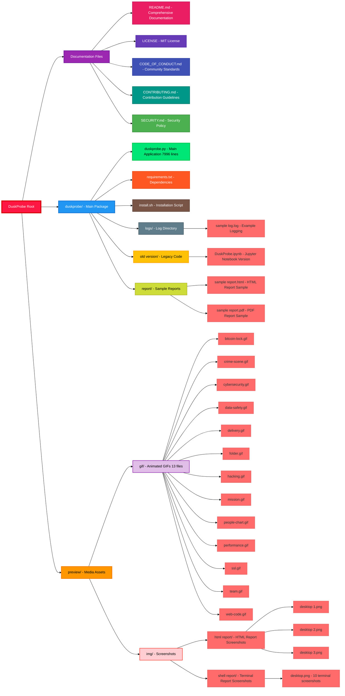

# DuskProbe  <a href=""></a>

DuskProbe is a cybersecurity assessment tool exclusively designed for legitimate security professionals, penetration testers, and authorized personnel conducting lawful security evaluations with **explicit written consent** from target system owners.
<hr>

[](https://www.youtube.com/watch?v=IH0FUPe/watch?v=IH0FUPe63CA)


---
## **LEGAL DISCLAIMER**  <a href=""></a>

 
**WARNING:** Unauthorized scanning, testing, or access to computer systems may constitute a criminal offense under computer fraud and abuse laws in your jurisdiction. Users assume complete legal responsibility for all scanning activities.
<hr>


 - **Possess valid authorization from target system owner(s)**
 - **Acknowledge full compliance with applicable cybersecurity regulations**
 - **Understand the legal implications of vulnerability assessment activities**
 - **Will use this tool only for legitimate security testing purposes**

---

## Overview  <a href=""></a>

**DuskProbe v5.0 is a state-of-the-art web application security scanner designed for comprehensive vulnerability assessment and penetration testing. Built with modern Python architecture and advanced security testing methodologies, DuskProbe provides professional-grade security analysis capabilities for cybersecurity professionals.**
<hr>

### **Mission Statement** <a href=""></a>


**To empower cybersecurity professionals with a comprehensive, reliable, and ethical web application security testing platform that adheres to industry standards and best practices while maintaining the highest levels of accuracy and efficiency.**

<hr>


###  **Technical Excellence**

<hr>

- **Advanced Detection Engine**: Multi-layered vulnerability detection with low false-positive rates
- **OWASP 2025 Compliance**: Full alignment with latest OWASP Top 10 security standards
- **Professional Reporting**: Industry-standard HTML and JSON report generation
- **Scalable Architecture**: Asynchronous processing for high-performance scanning
- **Comprehensive Coverage**: 25+ security testing modules and 62 reconnaissance components

---
##  HTML Report Preview
<p align="left">
  
  
      
</p>


<hr>

##  Terminal Report Preview

<p align="left">
  
  
      
</p>
<hr>

<p align="left">
  
  
      
</p>

<hr>

<p align="left">
  
  
      
</p>
<hr>


##  **Key Features**

<hr>

###  <p align="center"> **Core Security Testing** </p>

| Feature | Description | Coverage |
|---------|-------------|----------|
| **XSS Detection** | Comprehensive Cross-Site Scripting vulnerability detection | Reflected, Stored, DOM-based |
| **SQL Injection** | Advanced database injection testing | Union, Boolean, Time-based |
| **CSRF Protection** | Cross-Site Request Forgery vulnerability assessment | Token validation, SameSite analysis |
| **Authentication Bypass** | Credential and session security testing | Weak passwords, session hijacking |
| **Directory Traversal** | Path traversal and file inclusion vulnerabilities | LFI, RFI, directory enumeration |
| **Template Injection** | Server-side template injection detection | Jinja2, Twig, Smarty templates |
| **Command Injection** | OS command execution vulnerability testing | Blind, time-based detection |
| **File Upload Bypass** | Malicious file upload prevention testing | Extension, MIME type validation |

<hr>


###  **Advanced Reconnaissance**  <a href=""></a>


- **Technology Stack Detection**: Comprehensive framework and CMS identification
- **Directory & File Discovery**: Intelligent brute-force with smart wordlists
- **Parameter Mining**: Hidden and vulnerable parameter identification
- **SSL/TLS Analysis**: Certificate validation and encryption assessment
- **HTTP Header Security**: Security header compliance evaluation
- **WAF Detection**: Web Application Firewall identification and bypass techniques

<hr>

###  **Professional Reporting** <a href=""></a>

- **Industry-Standard HTML Reports**: Beautiful, interactive reports with Bungee typography
- **Executive Summary**: C-level executive briefings with risk assessments
- **Technical Intelligence**: Detailed technical findings for security teams
- **OWASP 2025 Mapping**: Complete compliance analysis and categorization
- **CVSS v3.1 Scoring**: Professional vulnerability severity assessment
- **Remediation Guidance**: Actionable security recommendations

<hr>


###  **Performance & Scalability** <a href=""></a>

- **Asynchronous Processing**: High-speed concurrent request handling
- **Rate Limiting**: Respectful scanning with configurable delays
- **Memory Optimization**: Efficient resource utilization for large-scale scans
- **Progress Tracking**: Real-time scan progress with detailed status updates
- **Error Handling**: Robust error recovery and continuation mechanisms

---

##  **Architecture**

<hr>

```python
# Core Dependencies
Python 3.8+              # Modern Python runtime
aiohttp                  # Asynchronous HTTP client
beautifulsoup4          # HTML parsing and analysis
requests                # HTTP request handling
rich                    # Terminal UI and progress tracking
pandas                  # Data analysis and reporting
selenium                # Browser automation (optional)
cryptography            # SSL/TLS analysis
```
<hr>

###  **Design Patterns** <a href="">

- **Modular Architecture**: Plug-and-play security testing modules
- **Asynchronous Programming**: Non-blocking I/O for optimal performance
- **Factory Pattern**: Dynamic vulnerability scanner instantiation
- **Observer Pattern**: Real-time progress monitoring and reporting
- **Strategy Pattern**: Configurable testing methodologies

<hr>


```
DuskProbe/
├── duskprobe.py                 # Main application entry point
├── requirements.txt             # Python dependencies
├── install.sh                   # Automated installation script
├── README.md                    # Comprehensive documentation
├── LICENSE                      # MIT license file
├── sample_urls.txt             # Example target URLs
├── logs/                       # Scan logging directory
│   └── duskprobe_*.log        # Timestamped scan logs
├── reports/                    # Generated security reports
│   ├── *.html                 # Professional HTML reports
│   ├── *.json                 # Machine-readable JSON reports
│   └── *.csv                  # Spreadsheet-compatible data
└── __pycache__/               # Python bytecode cache
```

---

##  **Quick Start**
<hr>

### **30-Second Setup**

```bash
# Clone the repository
git clone https://github.com/la-b-ib/DuskProbe.git
cd DuskProbe

# Run automated installation
chmod +x install.sh
./install.sh

# Start your first scan
python3 duskprobe.py -u https://example.com -f html
```
<hr>


###  **Basic Usage Examples**

```bash
# Single target scan with HTML report
python3 duskprobe.py -u https://target.com -f html -o security_report.html

# Multiple targets from file
python3 duskprobe.py -l targets.txt -f json -o bulk_scan_results.json

# Quick vulnerability assessment
python3 duskprobe.py -u https://webapp.com --quick-scan

# Comprehensive security audit
python3 duskprobe.py -u https://enterprise.com --full-scan --threads 10
```

---

##  **Installation** <a href="">


- **Python 3.8+** (Python 3.9+ recommended)
- **pip** package manager
- **Git** version control system


<hr>

###  **Automated Installation**


```bash
# Clone repository
git clone https://github.com/la-b-ib/DuskProbe.git
cd DuskProbe

# Make installation script executable
chmod +x install.sh

# Run automated setup
./install.sh
```

<hr>

###  **Manual Installation**


```bash
# 1. Clone the repository
git clone https://github.com/la-b-ib/DuskProbe.git
cd DuskProbe

# 2. Create virtual environment (recommended)
python3 -m venv duskprobe-env
source duskprobe-env/bin/activate  # Linux/macOS
# or
duskprobe-env\Scripts\activate     # Windows

# 3. Install core dependencies
pip install -r requirements.txt

# 4. Install additional security libraries
python3 install_additional_libs.py

# 5. Install advanced scanning modules
python3 install_advanced_libs.py

# 6. Verify installation
python3 duskprobe.py --version
```
<hr>

### **Docker Installation**


```dockerfile
# Dockerfile
FROM python:3.9-slim

WORKDIR /app
COPY . .

RUN pip install -r requirements.txt
RUN python3 install_additional_libs.py

ENTRYPOINT ["python3", "duskprobe.py"]
```

```bash
# Build and run
docker build -t duskprobe .
docker run -it duskprobe -u https://target.com -f html
```

<hr>

###  **Platform-Specific Notes**

<hr>

```bash
# Ubuntu/Debian additional dependencies
sudo apt-get update
sudo apt-get install python3-dev libssl-dev libffi-dev

# CentOS/RHEL additional dependencies
sudo yum install python3-devel openssl-devel libffi-devel
```

```bash
# Install Homebrew if not present
/bin/bash -c "$(curl -fsSL https://raw.githubusercontent.com/Homebrew/install/HEAD/install.sh)"

# Install Python and dependencies
brew install python@3.9
pip3 install -r requirements.txt
```

```powershell
# Open PowerShell as Administrator
Set-ExecutionPolicy -ExecutionPolicy RemoteSigned -Scope CurrentUser

# Install dependencies
pip install -r requirements.txt
```
<hr>

# Install dependencies


```bash
# Simple scan
./duskprobe.py https://example.com

# Scan with crawling
./duskprobe.py https://example.com --crawl

# Anonymous scan with Tor
./duskprobe.py https://example.com --tor
```

```bash
# JSON output for scripting
./duskprobe.py https://example.com --output-format json

# CSV export for analysis
./duskprobe.py https://example.com --output-format csv --export

# HTML report
./duskprobe.py https://example.com --output-format html

# Quiet mode (minimal output)
./duskprobe.py https://example.com --quiet
```

```bash
# Scan multiple URLs from file
./duskprobe.py --batch urls.txt

# Batch scan with JSON output
./duskprobe.py --batch urls.txt --output-format json --quiet
```

```bash
# Custom output directory
./duskprobe.py https://example.com --output-dir ./reports

# Verbose logging
./duskprobe.py https://example.com --verbose

# Custom timeout and page limits
./duskprobe.py https://example.com --timeout 30 --max-pages 10
```

<hr>

## Command Line Options

```
positional arguments:
  url                   Target URL to scan

optional arguments:
  -h, --help            show this help message and exit
  --batch FILE, -b FILE
                        Scan URLs from file (one per line)
  --crawl, -c           Enable crawling (slower but more thorough)
  --tor, -t             Use Tor for anonymity (requires Tor installation)
  --max-pages MAX_PAGES, -m MAX_PAGES
                        Maximum pages to crawl (default: 5)
  --timeout TIMEOUT     Request timeout in seconds (default: 15)
  --output-format {text,json,csv,html}, -f {text,json,csv,html}
                        Output format (default: text)
  --output-dir DIR, -o DIR
                        Output directory for reports (default: ./reports)
  --log-dir DIR         Log directory (default: ./logs)
  --export, -e          Export findings to CSV
  --quiet, -q           Suppress non-essential output
  --verbose, -v         Enable verbose output
  --version             show program's version number and exit
  --check-deps          Check for missing dependencies
```
<hr>

## Exit Codes <a href="">


- `0`: Success, no major vulnerabilities found
- `1`: High-risk vulnerabilities detected
- `2`: Critical vulnerabilities found
- `3`: Scan failures occurred
- `130`: Interrupted by user (Ctrl+C)

<hr>

## Example Workflows


```bash
#!/bin/bash
# Quick security check script

URL="https://example.com"
./duskprobe.py "$URL" --output-format json --quiet > scan_results.json

# Check exit code
if [ $? -eq 2 ]; then
    echo "CRITICAL vulnerabilities found!"
    # Send alert, stop deployment, etc.
elif [ $? -eq 1 ]; then
    echo "HIGH-risk issues detected!"
    # Log for review
else
    echo "No major issues found"
fi
```

```bash
#!/bin/bash
# Monitor multiple sites daily

URLS_FILE="production_urls.txt"
REPORT_DIR="daily_reports/$(date +%Y%m%d)"

./duskprobe.py --batch "$URLS_FILE" \
               --output-dir "$REPORT_DIR" \
               --output-format csv \
               --export \
               --quiet

# Process results, send notifications, etc.
```

```bash
#!/bin/bash
# Pre-deployment security check

STAGING_URL="https://staging.example.com"

echo "Running security scan on staging..."
./duskprobe.py "$STAGING_URL" --crawl --quiet --output-format json

EXIT_CODE=$?
if [ $EXIT_CODE -ge 2 ]; then
    echo "Security scan failed! Blocking deployment."
    exit 1
else
    echo "Security scan passed. Proceeding with deployment."
    exit 0
fi
```
<hr>

## File Formats


```
https://example.com
https://test.example.com
https://api.example.com/v1
```

```json
{
  "scan_info": {
    "timestamp": "2024-01-15T10:30:00",
    "total_pages": 3,
    "total_findings": 5
  },
  "site_info": {
    "url": "https://example.com",
    "domain": "example.com",
    "ip_address": "192.168.1.1",
    "server": "nginx/1.18.0"
  },
  "findings": [
    {
      "Type": "XSS",
      "Severity": "HIGH",
      "Details": "Reflected XSS vulnerability",
      "Risk Score": 8,
      "URL": "https://example.com/search?q=test",
      "Recommendation": "Implement input validation"
    }
  ]
}
```


<hr>

## Version History <a href="">


- **v5.0**: Complete rewrite with advanced features, OWASP 2025 compliance, professional HTML reports
- **v4.5**: Shell-optimized version with command-line interface
- **v4.0**: Enhanced reporting and additional security checks
- **v3.0**: Added Tor support and crawling capabilities
- **v2.0**: Introduced multiple output formats
- **v1.0**: Initial release

---

**Disclaimer**: This tool is provided for educational and authorized testing purposes only. Use responsibly and ethically.
<hr>

## File Structure Analysis




<hr>

## Python Code Architecture

```mermaid
%%{init: {'theme':'base', 'themeVariables': {'primaryColor':'#ff4757'}, 'flowchart': {'rankSpacing': 75, 'nodeSpacing': 45, 'curve': 'basis'}, 'layout': {'hierarchySeparation': 75, 'nodeSeparation': 45, 'edgeSeparation': 15}}}%%
graph LR
    A[DuskProbe v5.0 - Main Python Application 7996 lines]
    A --> B[Import System & Dependencies]
    A --> C[Configuration Management Layer]
    A --> D[Asynchronous Network Layer]
    A --> E[Security Engine Core]
    A --> F[Advanced Reconnaissance System]
    A --> G[Professional Reporting Engine]
    A --> H[CLI Interface & Control Flow]
    A --> I[Main Execution Pipeline]
    
    %% Import System & Dependencies
    B --> B1[Core Python Imports]
    B --> B2[Third-Party Libraries]
    B --> B3[Optional Security Libraries]
    B --> B4[Advanced Reconnaissance Tools]
    
    B1 --> B1A[os, re, json, socket, logging]
    B1 --> B1B[argparse, sys, asyncio, aiohttp]
    B1 --> B1C[pathlib.Path, datetime]
    B1 --> B1D[urllib.parse, typing]
    
    B2 --> B2A[rich.console.Console]
    B2 --> B2B[rich.table.Table]
    B2 --> B2C[rich.progress.Progress]
    B2 --> B2D[rich.panel.Panel]
    B2 --> B2E[beautifulsoup4, pandas, yaml]
    
    B3 --> B3A[shodan - IP Intelligence]
    B3 --> B3B[whois - Domain Analysis]
    B3 --> B3C[builtwith - Tech Stack]
    B3 --> B3D[waybackpy - Historical Data]
    B3 --> B3E[dns.resolver - DNS Tools]
    B3 --> B3F[sslyze - SSL/TLS Analysis]
    B3 --> B3G[selenium - Browser Automation]
    B3 --> B3H[nmap - Port Scanning]
    
    B4 --> B4A[scapy - Packet Analysis]
    B4 --> B4B[censys - Search Engine]
    B4 --> B4C[vulners - Vulnerability DB]
    B4 --> B4D[sublist3r - Subdomain Discovery]
    B4 --> B4E[paramiko - SSH Operations]
    B4 --> B4F[stem - Tor Integration]
    
    %% Configuration Management Layer
    C --> C1[DuskProbeConfig Class - Lines 245-310]
    
    C1 --> C1A[__init__ - Constructor Method]
    C1 --> C1B[_load_config_file - YAML Config Parser]
    C1 --> C1C[_setup_logging - Advanced Logging System]
    
    C1A --> C1A1[args - Command Line Arguments]
    C1A --> C1A2[reports_dir - Output Directory Path]
    C1A --> C1A3[logs_dir - Logging Directory Path]
    C1A --> C1A4[console - Rich Console Instance]
    
    C1B --> C1B1[YAML Safe Loading]
    C1B --> C1B2[Config Override Logic]
    C1B --> C1B3[Error Handling & Validation]
    
    C1C --> C1C1[RotatingFileHandler - 5MB Max]
    C1C --> C1C2[RichHandler - Console Output]
    C1C --> C1C3[Log Level Management]
    C1C --> C1C4[Timestamped Log Files]
    
    %% Asynchronous Network Layer
    D --> D1[AsyncSession Class - Lines 315-420]
    
    D1 --> D1A[__init__ - Session Initialization]
    D1 --> D1B[get - Async GET Method]
    D1 --> D1C[post - Async POST Method]
    D1 --> D1D[close - Resource Cleanup]
    D1 --> D1E[__aenter__ / __aexit__ - Context Manager]
    
    D1A --> D1A1[semaphore - Concurrency Limit 100]
    D1A --> D1A2[response_cache - Request Cache Dict]
    D1A --> D1A3[aiohttp.ClientSession Configuration]
    D1A --> D1A4[TCPConnector - Connection Pool 200]
    D1A --> D1A5[ClientTimeout - 3 Second Limit]
    D1A --> D1A6[Custom Headers - User Agent Rotation]
    
    D1B --> D1B1[Cache Lookup - Duplicate Prevention]
    D1B --> D1B2[Semaphore Control - Rate Limiting]
    D1B --> D1B3[Content Size Limiting - 100KB Max]
    D1B --> D1B4[Error Handling - Timeout & ClientError]
    D1B --> D1B5[Response Caching - 1000 Entry Limit]
    
    D1C --> D1C1[POST Data Handling]
    D1C --> D1C2[Custom Headers Support]
    D1C --> D1C3[Redirect Following]
    D1C --> D1C4[Content Length Limiting]
    
    %% Security Engine Core
    E --> E1[SecurityChecker Class - Lines 425-2800]
    
    E1 --> E1A[__init__ - Payload & Pattern Initialization]
    E1 --> E1B[get_site_info - Comprehensive Site Analysis]
    E1 --> E1C[check_vulnerability - Main Vulnerability Scanner]
    E1 --> E1D[full_check - Complete Security Assessment]
    E1 --> E1E[check_headers - Security Header Validation]
    
    E1A --> E1A1[Payload Database Initialization]
    E1A --> E1A2[Error Pattern Compilation]
    E1A --> E1A3[File Indicator Patterns]
    E1A --> E1A4[Cloud Metadata Patterns]
    
    E1A1 --> E1A1A[XSS Payloads - 14 Advanced Variants]
    E1A1 --> E1A1B[SQLi Payloads - 15 Database Types]
    E1A1 --> E1A1C[LFI Payloads - 15 Path Traversal]
    E1A1 --> E1A1D[RFI Payloads - 4 Remote Inclusion]
    E1A1 --> E1A1E[CMD Injection - 14 OS Commands]
    E1A1 --> E1A1F[SSRF Payloads - 11 Internal Targets]
    E1A1 --> E1A1G[XXE Payloads - 3 XML External Entity]
    E1A1 --> E1A1H[Template Injection - 9 Engine Types]
    E1A1 --> E1A1I[NoSQL Injection - 7 Database Variants]
    E1A1 --> E1A1J[LDAP Injection - 5 Directory Attacks]
    E1A1 --> E1A1K[XPath Injection - 4 XML Queries]
    E1A1 --> E1A1L[Sensitive Files - 25 Critical Paths]
    E1A1 --> E1A1M[Open Redirect - 7 Bypass Methods]
    E1A1 --> E1A1N[CRLF Injection - 4 Header Injection]
    
    E1B --> E1B1[_analyze_server_hosting - Server Intelligence]
    E1B --> E1B2[_analyze_backend_stack - Technology Detection]
    E1B --> E1B3[_analyze_frontend_stack - Client Analysis]
    E1B --> E1B4[_analyze_network_protocol - Protocol Assessment]
    E1B --> E1B5[_perform_reconnaissance - Intelligence Gathering]
    
    E1C --> E1C1[Quick Detection Methods]
    E1C --> E1C2[Deep Pattern Analysis]
    E1C --> E1C3[POST-Based Vulnerability Checks]
    E1C --> E1C4[Finding Creation & CVSS Scoring]
    
    E1C1 --> E1C1A[_quick_detect_xss - Immediate XSS Detection]
    E1C1 --> E1C1B[_quick_detect_sqli - Fast SQL Error Detection]
    E1C1 --> E1C1C[_quick_detect_lfi - File Inclusion Indicators]
    E1C1 --> E1C1D[_quick_detect_command_injection - OS Command Output]
    E1C1 --> E1C1E[_quick_detect_ssrf - Cloud Metadata Detection]
    E1C1 --> E1C1F[_quick_detect_sensitive_file - Configuration Files]
    E1C1 --> E1C1G[_quick_detect_nosql - NoSQL Error Patterns]
    E1C1 --> E1C1H[_quick_detect_ldap - LDAP Directory Errors]
    E1C1 --> E1C1I[_quick_detect_xpath - XPath Syntax Errors]
    E1C1 --> E1C1J[_quick_detect_open_redirect - Location Headers]
    E1C1 --> E1C1K[_quick_detect_crlf - Header Injection Detection]
    
    E1C2 --> E1C2A[_detect_xss - Advanced XSS Analysis]
    E1C2 --> E1C2B[_detect_sqli - Database Error Patterns]
    E1C2 --> E1C2C[_detect_lfi - File System Indicators]
    E1C2 --> E1C2D[_detect_command_injection - Command Output Analysis]
    E1C2 --> E1C2E[_detect_ssrf - Internal Network Access]
    E1C2 --> E1C2F[_detect_xxe - XML External Entity]
    E1C2 --> E1C2G[_detect_template_injection - Template Engine Errors]
    E1C2 --> E1C2H[_detect_nosql_injection - NoSQL Database Errors]
    E1C2 --> E1C2I[_detect_ldap_injection - Directory Service Errors]
    E1C2 --> E1C2J[_detect_xpath_injection - XML Query Errors]
    E1C2 --> E1C2K[_detect_open_redirect - Redirect Analysis]
    E1C2 --> E1C2L[_detect_crlf_injection - HTTP Header Manipulation]
    E1C2 --> E1C2M[_detect_sensitive_file - Configuration Detection]
    
    E1C4 --> E1C4A[_create_finding - OWASP 2025 Compliance]
    E1C4 --> E1C4B[_calculate_risk_score - CVSS Calculation]
    E1C4 --> E1C4C[_get_compliance_impact - Regulatory Mapping]
    E1C4 --> E1C4D[_assess_exploitability - Attack Complexity]
    E1C4 --> E1C4E[_get_discovery_method - Detection Classification]
    
    E1D --> E1D1[Priority Task Management]
    E1D --> E1D2[Batch Processing - 25 Task Groups]
    E1D --> E1D3[Progress Tracking Integration]
    E1D --> E1D4[Advanced Discovery Analysis]
    
    E1D1 --> E1D1A[High Priority - Critical Vulnerabilities]
    E1D1 --> E1D1B[Medium Priority - Standard Vulnerabilities]
    E1D1 --> E1D1C[Specialized Injection Types]
    E1D1 --> E1D1D[Header Security Validation]
    
    %% Advanced Reconnaissance System
    F --> F1[Intelligence Gathering Methods]
    F --> F2[Technology Detection Systems]
    F --> F3[Network & Infrastructure Analysis]
    F --> F4[Advanced Discovery Engines]
    
    F1 --> F1A[_detect_cloud_provider - AWS/GCP/Azure Detection]
    F1 --> F1B[_detect_cdn - Content Delivery Network ID]
    F1 --> F1C[_detect_load_balancer - Traffic Distribution]
    F1 --> F1D[_detect_waf - Web Application Firewall]
    F1 --> F1E[_detect_programming_language - Backend Tech]
    F1 --> F1F[_detect_web_framework - Framework ID]
    F1 --> F1G[_detect_database_technology - Database Hints]
    F1 --> F1H[_detect_application_server - Server Software]
    
    F2 --> F2A[_detect_js_frameworks - JavaScript Libraries]
    F2 --> F2B[_detect_css_frameworks - Styling Systems]
    F2 --> F2C[_detect_build_tools - Development Tools]
    F2 --> F2D[_detect_package_managers - Dependency Managers]
    F2 --> F2E[_detect_ui_libraries - Component Systems]
    F2 --> F2F[_detect_pwa_features - Progressive Web Apps]
    F2 --> F2G[_detect_spa_indicators - Single Page Apps]
    F2 --> F2H[_detect_third_party_integrations - External Services]
    
    F3 --> F3A[_detect_http_version - Protocol Version]
    F3 --> F3B[_assess_protocol_security - Security Assessment]
    F3 --> F3C[_analyze_network_performance - Latency Analysis]
    F3 --> F3D[_analyze_dns_configuration - DNS Records]
    F3 --> F3E[_perform_basic_port_scan - Open Port Detection]
    F3 --> F3F[_analyze_security_headers - Header Validation]
    F3 --> F3G[_analyze_compression - Content Encoding]
    F3 --> F3H[_analyze_cookies - Cookie Security]
    F3 --> F3I[_analyze_cors_configuration - CORS Policy]
    
    F4 --> F4A[_advanced_webpage_discovery - Page Enumeration]
    F4 --> F4B[_advanced_file_leak_detection - Sensitive Files]
    F4 --> F4C[_advanced_parameter_enumeration - Parameter Mining]
    F4 --> F4D[_website_structure_mapping - Site Architecture]
    F4 --> F4E[_comprehensive_vulnerability_scan - Full Assessment]
    F4 --> F4F[_advanced_shodan_reconnaissance - IP Intelligence]
    F4 --> F4G[_advanced_whois_analysis - Domain Intelligence]
    F4 --> F4H[_advanced_technology_detection - Stack Analysis]
    F4 --> F4I[_wayback_machine_analysis - Historical Data]
    F4 --> F4J[_advanced_dns_reconnaissance - DNS Intelligence]
    F4 --> F4K[_advanced_ssl_analysis - Certificate Analysis]
    F4 --> F4L[_advanced_http_analysis - Protocol Deep Dive]
    F4 --> F4M[_network_packet_analysis - Traffic Analysis]
    
    %% Professional Reporting Engine
    G --> G1[Report Class - Multi-Format Output]
    
    G1 --> G1A[generate_report - Main Report Generator]
    G1 --> G1B[_generate_html_report - Professional HTML]
    G1 --> G1C[_generate_json_report - Machine Readable]
    G1 --> G1D[_generate_csv_report - Data Analysis]
    G1 --> G1E[_display_terminal_report - Rich Console]
    
    G1A --> G1A1[Result Processing & Validation]
    G1A --> G1A2[Format Detection & Routing]
    G1A --> G1A3[Executive Summary Generation]
    G1A --> G1A4[Technical Intelligence Compilation]
    G1A --> G1A5[OWASP 2025 Compliance Mapping]
    
    G1B --> G1B1[HTML Template Processing]
    G1B --> G1B2[Bungee Typography Integration]
    G1B --> G1B3[Interactive Charts & Graphs]
    G1B --> G1B4[CVSS Score Visualization]
    G1B --> G1B5[Vulnerability Category Organization]
    G1B --> G1B6[Remediation Action Plans]
    
    G1C --> G1C1[JSON Schema Validation]
    G1C --> G1C2[API Integration Format]
    G1C --> G1C3[Automation-Ready Output]
    G1C --> G1C4[Timestamp & Metadata]
    
    G1E --> G1E1[Rich Table Formatting]
    G1E --> G1E2[Color-Coded Severity Levels]
    G1E --> G1E3[Progress Bar Integration]
    G1E --> G1E4[Panel-Based Layout]
    G1E --> G1E5[ASCII Art & Branding]
    
    %% CLI Interface & Control Flow
    H --> H1[Argument Processing System]
    H --> H2[Rich Console Integration]
    H --> H3[Progress Management]
    H --> H4[Error Handling & Recovery]
    
    H1 --> H1A[create_parser - Command Line Parser]
    H1 --> H1B[URL Validation & Processing]
    H1 --> H1C[Batch File Processing]
    H1 --> H1D[Output Format Selection]
    H1 --> H1E[Configuration Override Handling]
    
    H2 --> H2A[Console Initialization]
    H2 --> H2B[Legal Disclaimer Display]
    H2 --> H2C[Professional Header Display]
    H2 --> H2D[Footer & Credits Display]
    
    H3 --> H3A[Progress Column Configuration]
    H3 --> H3B[Task Creation & Management]
    H3 --> H3C[Real-time Progress Updates]
    H3 --> H3D[Completion Status Tracking]
    
    %% Main Execution Pipeline
    I --> I1[main - Primary Async Function]
    I --> I2[run_scan - Individual URL Scanner]
    I --> I3[simple_crawl - Website Crawling]
    I --> I4[Utility Functions]
    
    I1 --> I1A[Configuration Initialization]
    I1 --> I1B[Dependency Validation]
    I1 --> I1C[URL Collection & Processing]
    I1 --> I1D[Concurrent Scan Execution]
    I1 --> I1E[Result Aggregation]
    I1 --> I1F[Final Report Generation]
    I1 --> I1G[Exit Code Determination]
    
    I2 --> I2A[AsyncSession Context Creation]
    I2 --> I2B[SecurityChecker Initialization]
    I2 --> I2C[Full Security Assessment]
    I2 --> I2D[Error Handling & Recovery]
    I2 --> I2E[Result Return Processing]
    
    I3 --> I3A[Link Extraction from HTML]
    I3 --> I3B[URL Normalization & Filtering]
    I3 --> I3C[Depth-Limited Crawling]
    I3 --> I3D[Duplicate URL Prevention]
    
    I4 --> I4A[setup_signal_handlers - Graceful Shutdown]
    I4 --> I4B[display_banner - Professional Branding]
    I4 --> I4C[display_professional_footer - Credits]
    I4 --> I4D[check_dependencies - Validation]
    
    %% Styling - Ultra Vibrant Color Scheme
    style A fill:#e91e63,stroke:#ad1457,stroke-width:5px,color:#fff
    style E fill:#00e676,stroke:#00c853,stroke-width:4px,color:#000
    style D fill:#2196f3,stroke:#1565c0,stroke-width:4px,color:#fff
    style F fill:#ff9800,stroke:#ef6c00,stroke-width:4px,color:#000
    style G fill:#9c27b0,stroke:#6a1b9a,stroke-width:4px,color:#fff
    style H fill:#ff5722,stroke:#d84315,stroke-width:4px,color:#fff
    style I fill:#4caf50,stroke:#2e7d32,stroke-width:4px,color:#fff
    style B fill:#673ab7,stroke:#4527a0,stroke-width:3px,color:#fff
    style C fill:#009688,stroke:#00695c,stroke-width:3px,color:#fff
    style E1A1 fill:#ffeb3b,stroke:#f57f17,stroke-width:3px,color:#000
    style E1C1 fill:#03a9f4,stroke:#0277bd,stroke-width:3px,color:#fff
    style E1C2 fill:#8bc34a,stroke:#558b2f,stroke-width:3px,color:#000
    style B1 fill:#f44336,stroke:#c62828,stroke-width:2px,color:#fff
    style B2 fill:#3f51b5,stroke:#283593,stroke-width:2px,color:#fff
    style B3 fill:#795548,stroke:#4e342e,stroke-width:2px,color:#fff
    style B4 fill:#607d8b,stroke:#37474f,stroke-width:2px,color:#fff
    style C1 fill:#e1bee7,stroke:#7b1fa2,stroke-width:2px,color:#000
    style D1 fill:#b3e5fc,stroke:#0277bd,stroke-width:2px,color:#000
    style F1 fill:#fff3e0,stroke:#ef6c00,stroke-width:2px,color:#000
    style G1 fill:#f3e5f5,stroke:#6a1b9a,stroke-width:2px,color:#000
```




<hr>

## Jupyter Notebook Code Architecture

```mermaid
%%{init: {'theme':'base', 'themeVariables': {'primaryColor':'#ff6b6b'}, 'flowchart': {'rankSpacing': 70, 'nodeSpacing': 40, 'curve': 'basis'}, 'layout': {'hierarchySeparation': 70, 'nodeSeparation': 40, 'edgeSeparation': 10}}}%%
graph LR
    A[DuskProbe v4.5 Jupyter Notebook - 1056 lines]
    A --> B[Cell Structure Analysis]
    A --> C[Import & Dependency Management]
    A --> D[Core Scanner Classes]
    A --> E[Vulnerability Detection Engine]
    A --> F[Colab Integration Layer]
    A --> G[Interactive Report Generation]
    A --> H[Data Analysis & Visualization]
    
    %% Cell Structure Analysis
    B --> B1[Cell 1 - Project Header & Documentation]
    B --> B2[Cell 2 - Automatic Dependency Installation]
    B --> B3[Cell 3 - Complete Code Documentation]
    B --> B4[Cell 4 - Standard Library Imports]
    B --> B5[Cell 5 - Google Colab Detection]
    B --> B6[Cell 6 - Optional Imports with Fallbacks]
    B --> B7[Cell 7-15 - Core Implementation Cells]
    B --> B8[Cell 16+ - Interactive Execution Cells]
    
    B1 --> B1A[Project Title & Version Info]
    B1 --> B1B[Enhanced Features Description]
    B1 --> B1C[Professional Report Formatting Notes]
    B1 --> B1D[Performance & Error Handling Info]
    
    B2 --> B2A[Automated pip Installation]
    B2 --> B2B[System Package Installation]
    B2 --> B2C[Tor Installation for Anonymity]
    B2 --> B2D[Success Confirmation Message]
    
    %% Import & Dependency Management
    C --> C1[Standard Library Block]
    C --> C2[Third-Party Library Block]
    C --> C3[Colab-Specific Imports]
    C --> C4[Conditional Import Handling]
    
    C1 --> C1A[os - Operating System Interface]
    C1 --> C1B[re - Regular Expression Operations]
    C1 --> C1C[json - JSON Data Handling]
    C1 --> C1D[time - Time-Related Functions]
    C1 --> C1E[socket - Network Communication]
    C1 --> C1F[base64 - Base64 Encoding/Decoding]
    C1 --> C1G[hashlib - Cryptographic Hashing]
    C1 --> C1H[subprocess - Process Management]
    C1 --> C1I[logging - Event Logging System]
    C1 --> C1J[urllib.parse - URL Manipulation]
    C1 --> C1K[pathlib.Path - File System Paths]
    C1 --> C1L[datetime - Date/Time Objects]
    C1 --> C1M[typing - Type Hints Support]
    C1 --> C1N[urllib3.util.retry - Request Retry Logic]
    C1 --> C1O[requests.adapters - HTTP Adapters]
    
    C2 --> C2A[requests - HTTP Request Library]
    C2 --> C2B[pandas - Data Analysis Framework]
    C2 --> C2C[numpy - Numerical Computing]
    
    C3 --> C3A[google.colab.output - Colab Output Control]
    C3 --> C3B[IPython.display - Rich Display System]
    C3 --> C3C[IS_COLAB - Environment Detection Flag]
    
    C4 --> C4A[BeautifulSoup - HTML Parsing]
    C4 --> C4B[colorama - Terminal Color Support]
    C4 --> C4C[fake_useragent - User Agent Rotation]
    C4 --> C4D[Fallback Classes for Missing Dependencies]
    
    %% Core Scanner Classes
    D --> D1[WebScanner Class - Main Scanner Engine]
    D --> D2[RequestHandler Class - HTTP Management]
    D --> D3[VulnerabilityChecker Class - Security Tests]
    D --> D4[ReportGenerator Class - Output Generation]
    
    D1 --> D1A[__init__ - Scanner Initialization]
    D1 --> D1B[scan_target - Main Scanning Method]
    D1 --> D1C[setup_session - HTTP Session Configuration]
    D1 --> D1D[cleanup - Resource Management]
    
    D1A --> D1A1[target_url - URL to Scan]
    D1A --> D1A2[scan_results - Results Storage]
    D1A --> D1A3[session - Requests Session]
    D1A --> D1A4[user_agents - UA Rotation List]
    D1A --> D1A5[vulnerability_tests - Test Registry]
    
    D1B --> D1B1[URL Validation & Normalization]
    D1B --> D1B2[Initial Site Information Gathering]
    D1B --> D1B3[Security Header Analysis]
    D1B --> D1B4[Vulnerability Test Execution]
    D1B --> D1B5[Results Compilation & Scoring]
    
    D2 --> D2A[make_request - HTTP Request Handler]
    D2 --> D2B[handle_redirects - Redirect Management]
    D2 --> D2C[parse_response - Response Processing]
    D2 --> D2D[error_handling - Exception Management]
    
    D2A --> D2A1[Request Timeout Configuration]
    D2A --> D2A2[Header Manipulation]
    D2A --> D2A3[SSL Certificate Handling]
    D2A --> D2A4[Retry Logic Implementation]
    
    D3 --> D3A[test_xss - Cross-Site Scripting]
    D3 --> D3B[test_sql_injection - SQL Injection]
    D3 --> D3C[test_lfi - Local File Inclusion]
    D3 --> D3D[test_open_redirect - Open Redirect]
    D3 --> D3E[test_idor - Insecure Direct Object Reference]
    D3 --> D3F[test_csrf - Cross-Site Request Forgery]
    D3 --> D3G[test_security_headers - Header Validation]
    D3 --> D3H[test_cryptominers - Mining Script Detection]
    
    %% Vulnerability Detection Engine
    E --> E1[Payload Management System]
    E --> E2[Pattern Recognition Engine]
    E --> E3[Response Analysis Framework]
    E --> E4[Risk Assessment Logic]
    
    E1 --> E1A[XSS Payload Database]
    E1 --> E1B[SQL Injection Payload Set]
    E1 --> E1C[LFI Path Traversal Payloads]
    E1 --> E1D[Open Redirect Test URLs]
    E1 --> E1E[IDOR Parameter Variations]
    E1 --> E1F[CSRF Token Bypass Methods]
    
    E1A --> E1A1[Basic Script Injection]
    E1A --> E1A2[Event Handler Injection]
    E1A --> E1A3[JavaScript Protocol Usage]
    E1A --> E1A4[HTML Entity Encoding Bypass]
    E1A --> E1A5[SVG-based XSS Vectors]
    
    E1B --> E1B1[Union-based Injection]
    E1B --> E1B2[Boolean-based Blind SQL]
    E1B --> E1B3[Time-based Blind SQL]
    E1B --> E1B4[Error-based Information Extraction]
    E1B --> E1B5[Second-order SQL Injection]
    
    E2 --> E2A[Error Message Pattern Matching]
    E2 --> E2B[Success Indicator Detection]
    E2 --> E2C[Behavior-based Analysis]
    E2 --> E2D[Response Time Analysis]
    
    E2A --> E2A1[Database Error Patterns]
    E2A --> E2A2[Server Error Messages]
    E2A --> E2A3[Application Framework Errors]
    E2A --> E2A4[Custom Error Page Detection]
    
    E3 --> E3A[HTTP Status Code Analysis]
    E3 --> E3B[Content-Length Comparison]
    E3 --> E3C[Response Header Examination]
    E3 --> E3D[Content Pattern Analysis]
    
    E4 --> E4A[CVSS Score Calculation]
    E4 --> E4B[Exploitability Assessment]
    E4 --> E4C[Impact Evaluation]
    E4 --> E4D[Risk Prioritization]
    
    %% Colab Integration Layer
    F --> F1[Interactive Input System]
    F --> F2[Progress Display Management]
    F --> F3[Cell Output Formatting]
    F --> F4[Error Handling for Colab]
    
    F1 --> F1A[URL Input Prompts]
    F1 --> F1B[Scan Configuration Options]
    F1 --> F1C[Output Format Selection]
    F1 --> F1D[Advanced Options Menu]
    
    F2 --> F2A[Real-time Progress Bars]
    F2 --> F2B[Status Message Updates]
    F2 --> F2C[Time Estimation Display]
    F2 --> F2D[Completion Notifications]
    
    F3 --> F3A[HTML Rich Output Generation]
    F3 --> F3B[Markdown Report Formatting]
    F3 --> F3C[Interactive Chart Creation]
    F3 --> F3D[Color-coded Result Display]
    
    %% Interactive Report Generation
    G --> G1[Pandas DataFrame Integration]
    G --> G2[HTML Report Generation]
    G --> G3[CSV Export Functionality]
    G --> G4[Interactive Visualization]
    
    G1 --> G1A[Vulnerability Results DataFrame]
    G1 --> G1B[Site Information DataFrame]
    G1 --> G1C[Security Header Analysis DataFrame]
    G1 --> G1D[Risk Assessment Summary DataFrame]
    
    G1A --> G1A1[Vulnerability Type Classification]
    G1A --> G1A2[Severity Level Assignment]
    G1A --> G1A3[Detection Confidence Scoring]
    G1A --> G1A4[Remediation Recommendation Mapping]
    
    G2 --> G2A[Professional HTML Template]
    G2 --> G2B[CSS Styling Integration]
    G2 --> G2C[JavaScript Chart Libraries]
    G2 --> G2D[Executive Summary Generation]
    
    G3 --> G3A[Raw Data CSV Export]
    G3 --> G3B[Summary Statistics CSV]
    G3 --> G3C[Timeline-based Export]
    G3 --> G3D[Compliance Report CSV]
    
    G4 --> G4A[Vulnerability Distribution Charts]
    G4 --> G4B[Risk Level Heat Maps]
    G4 --> G4C[Timeline Analysis Graphs]
    G4 --> G4D[Comparative Analysis Charts]
    
    %% Data Analysis & Visualization
    H --> H1[Statistical Analysis Engine]
    H --> H2[Trend Analysis System]
    H --> H3[Comparative Assessment]
    H --> H4[Predictive Risk Modeling]
    
    H1 --> H1A[Vulnerability Frequency Analysis]
    H1 --> H1B[Risk Distribution Statistics]
    H1 --> H1C[Detection Rate Calculations]
    H1 --> H1D[Time-to-Detection Metrics]
    
    H2 --> H2A[Historical Vulnerability Trends]
    H2 --> H2B[Risk Evolution Tracking]
    H2 --> H2C[Seasonal Pattern Recognition]
    H2 --> H2D[Improvement Rate Analysis]
    
    H3 --> H3A[Industry Benchmark Comparison]
    H3 --> H3B[Best Practice Compliance Scoring]
    H3 --> H3C[Peer Group Analysis]
    H3 --> H3D[Regulatory Standard Mapping]
    
    H4 --> H4A[Future Risk Projection]
    H4 --> H4B[Attack Vector Probability]
    H4 --> H4C[Impact Severity Forecasting]
    H4 --> H4D[Remediation Priority Optimization]
    
    %% Notebook-Specific Ultra Vibrant Styling
    style A fill:#e91e63,stroke:#ad1457,stroke-width:5px,color:#fff
    style D fill:#00bcd4,stroke:#00838f,stroke-width:4px,color:#fff
    style E fill:#3f51b5,stroke:#283593,stroke-width:4px,color:#fff
    style F fill:#4caf50,stroke:#2e7d32,stroke-width:4px,color:#fff
    style G fill:#ff9800,stroke:#ef6c00,stroke-width:4px,color:#000
    style H fill:#9c27b0,stroke:#6a1b9a,stroke-width:4px,color:#fff
    style B fill:#ff5722,stroke:#d84315,stroke-width:3px,color:#fff
    style C fill:#2196f3,stroke:#1565c0,stroke-width:3px,color:#fff
    style B1 fill:#ffeb3b,stroke:#f57f17,stroke-width:2px,color:#000
    style B2 fill:#8bc34a,stroke:#558b2f,stroke-width:2px,color:#000
    style B3 fill:#ff4081,stroke:#c2185b,stroke-width:2px,color:#fff
    style B4 fill:#7c4dff,stroke:#512da8,stroke-width:2px,color:#fff
    style C1 fill:#40e0d0,stroke:#00695c,stroke-width:2px,color:#000
    style C2 fill:#ffa726,stroke:#e65100,stroke-width:2px,color:#000
    style C3 fill:#ab47bc,stroke:#7b1fa2,stroke-width:2px,color:#fff
    style C4 fill:#66bb6a,stroke:#2e7d32,stroke-width:2px,color:#fff
    style D1 fill:#42a5f5,stroke:#1565c0,stroke-width:2px,color:#fff
    style D2 fill:#26c6da,stroke:#00838f,stroke-width:2px,color:#000
    style D3 fill:#5c6bc0,stroke:#283593,stroke-width:2px,color:#fff
    style D4 fill:#78909c,stroke:#37474f,stroke-width:2px,color:#fff
```



<hr>

## Project Documentation

<div style="display: flex; gap: 10px; margin: 15px 0; align-items: center; flex-wrap: wrap;">

[](LICENSE)
[](SECURITY.md)
[](CONTRIBUTING.md)
[](CODE_OF_CONDUCT.md)

</div>
<hr>

## Contact Information


  
[](mailto:labib.45x@gmail.com)
[](https://github.com/la-b-ib)
[](https://www.linkedin.com/in/la-b-ib/)
[](https://la-b-ib.github.io/)


---
