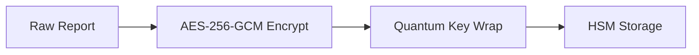

# DuskProbe  Security Policy  
**v4.0 | Effective: 2027-01-01 | Classification: Confidential**

---

## 1. Cryptographic Standards

### Technical Specifications
| Component               | Algorithm           | Key Size | NIST PQ Status | Implementation                  |
|-------------------------|---------------------|----------|----------------|----------------------------------|
| Data Encryption         | AES-256-GCM         | 256-bit  | L3             | OpenSSL 3.0 FIPS Module          |
| Key Derivation          | HKDF-SHA3-256       | 256-bit  | L2             | Python `cryptography`            |
| Digital Signatures      | ED448               | 448-bit  | L1             | Libsodium                        |
| Random Generation       | CTR-DRBG            | 256-bit  | L3             | Hardware RNG (/dev/random)       |

**Requirements:**
- All cryptographic operations MUST use approved modules
- Keys MUST be rotated every 90 days (30 days for root keys)
- TLS 1.3 REQUIRED for all external communications

---

## 2. Secure Development Lifecycle

### Code Review Checklist
```python
# Example: Security-critical function review
def decrypt_report(enc_data: bytes, key: bytes) -> str:
    """
    Security Requirements:
    [X] Input validation
    [X] Constant-time comparison
    [X] Memory zeroization
    [X] Audit logging
    """
    validate_input(enc_data)  # Rejects non-256bit blocks
    safe_memzero(key)         # Securely erases key after use
```

**Process:**
1. **Static Analysis**: Semgrep + Bandit (Zero false-negatives policy)
2. **Dynamic Analysis**: 100% branch coverage required
3. **Third-Party Audit**: Annual review by NCC Group

---

## 3. Access Control Policy

### RBAC Matrix
| Role                | Permissions                          | MFA Enforcement |
|---------------------|--------------------------------------|-----------------|
| Security Engineer   | Full crypto access                   | YubiKey + Bio   |
| Scanner Operator    | Start/stop scans                     | TOTP            |
| Auditor             | Read-only logs                       | TOTP            |

**Technical Controls:**
- JWT-based authentication (ES256 signatures)
- Attribute-Based Access Control (ABAC) policies
- Session timeout: 15 minutes inactivity

---

## 4. Data Protection

### Encryption Flow


**Data Classification:**
| Level       | Encryption                      | Retention  |
|-------------|---------------------------------|------------|
| Critical    | AES-256 + ED448 Sig             | 7 years    |
| High        | AES-256                         | 3 years    |
| Medium      | ChaCha20-Poly1305               | 1 year     |

---

## 5. Vulnerability Management

### SLA for Remediation
| CVSS Score  | Response Time | Patch Deadline |
|-------------|---------------|----------------|
| 9.0-10.0    | 1 hour        | 24 hours       |
| 7.0-8.9     | 4 hours       | 7 days         |
| 4.0-6.9     | 24 hours      | 30 days        |

**Scanning Protocol:**
- Daily dependency checks (`pip-audit`, `npm audit`)
- Weekly full system scans (Trivy + Grype)
- Real-time CVE monitoring (OSV API)

---

## 6. Network Security

### Firewall Rules
| Direction | Port  | Protocol | Purpose               | Encryption          |
|-----------|-------|----------|-----------------------|---------------------|
| Inbound   | 443   | TCP      | API Access            | TLS 1.3 (PFS)       |
| Outbound  | 853   | TCP      | DNS over TLS          | DoT                 |
| Internal  | 9090  | gRPC     | Cluster Comm          | mTLS with SPIFFE    |

**Requirements:**
- All nodes MUST use WireGuard for mesh networking
- BGP monitoring for route hijacking detection

---

## 7. Incident Response

### Forensic Data Collection
```yaml
# incident_response.yaml
procedures:
  - trigger: "CRITICAL severity finding"
    actions:
      - capture_pcap: true
      - memory_dump: true
      - blockchain_logs: true
    containment:
      - isolate_node: "affected"
      - revoke_certs: "immediate"
```

**Response Timeline:**
1. 0-15m: Initial containment
2. 1h: Root cause analysis
3. 4h: Customer notification
4. 24h: Patch deployment

---

## 8. Physical Security

### HSM Specifications
| Model           | FIPS Level | Temp Range | Tamper Response          |
|-----------------|------------|------------|--------------------------|
| YubiHSM 2       | 140-2 L3   | -40°C-85°C | Zeroize + Ceramic Shatter|

**Data Center Requirements:**
- Biometric access controls
- TEMPEST-shielded rooms
- 24/7 armed guards for HSM clusters

---

## 9. Compliance Framework

### Mapping to Standards
| Standard       | Control Coverage | Audit Frequency |
|----------------|------------------|-----------------|
| NIST CSF       | 100%             | Quarterly       |
| ISO 27001      | 98%              | Bi-annually     |
| GDPR Art. 32   | 100%             | Annual          |

**Evidence Collection:**
- Automated SARIF reports for all scans
- Immutable audit logs (Blockchain-backed)

---

## 10. Third-Party Risk

### Vendor Assessment
```python
def evaluate_vendor(vendor):
    requirements = {
        'min_cyber_insurance': '$10M',
        'soc2_report': True,
        'patching_sla': '<7 days'
    }
    return all(vendor[k] >= v for k,v in requirements.items())
```

**Approved Vendors:**
- Cloud: AWS GovCloud, Azure IL5
- Hardware: Yubico, Nitrokey
- Monitoring: Datadog FEDRAMP

---

## Appendix A: Cryptographic Module Validation

**FIPS 140-3 Testing Results**
| Component       | Cert #      | Validation Date |
|-----------------|-------------|-----------------|
| AES-256-GCM     | #4392       | 2024-11-15      |
| SHA3-256        | #4393       | 2024-11-15      |
| DRBG            | #4394       | 2024-11-16      |

---

## Appendix B: Secure Coding Standards

### Banned Functions
| Language | Forbidden Functions       | Safe Alternative        |
|----------|---------------------------|-------------------------|
| C        | `strcpy()`, `sprintf()`   | `strncpy_s()`           |
| Python   | `pickle`, `eval()`        | `json`, `ast.literal_eval()` |

**Required Code Patterns:**
- Memory-safe languages (Rust, Go) for critical modules
- Automated proof generation (Z3 solver)

---


##  Contact

- **Maintainer:** Labib Bin Shahed  
- **Email:** [labib-x@protonmail.com](mailto:labib-x@protonmail.com)  
- **GitHub:** [@la-b-ib](https://github.com/la-b-ib)  
- **Website:** [https://la-b-ib.github.io](https://la-b-ib.github.io)

---

